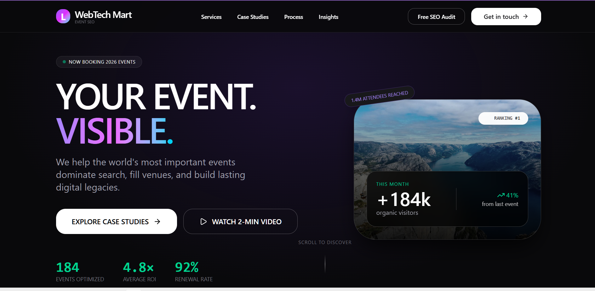
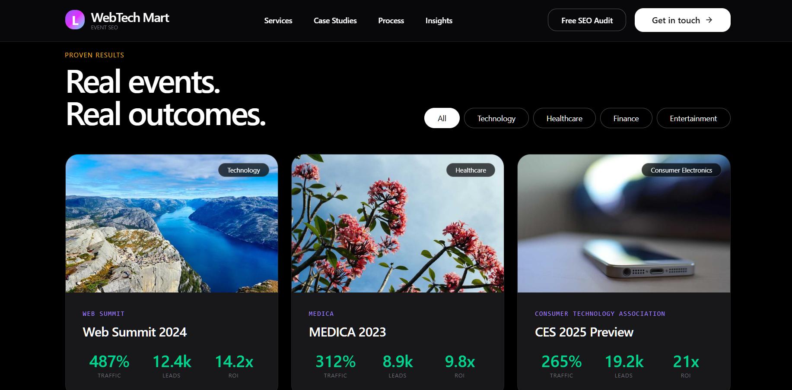
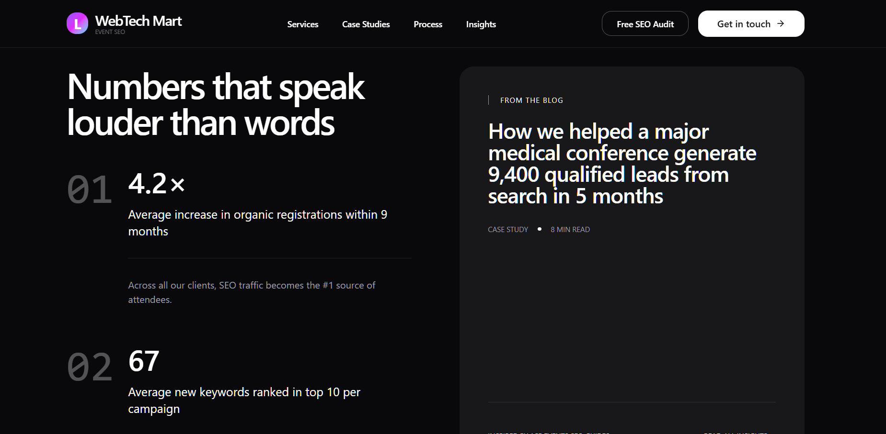
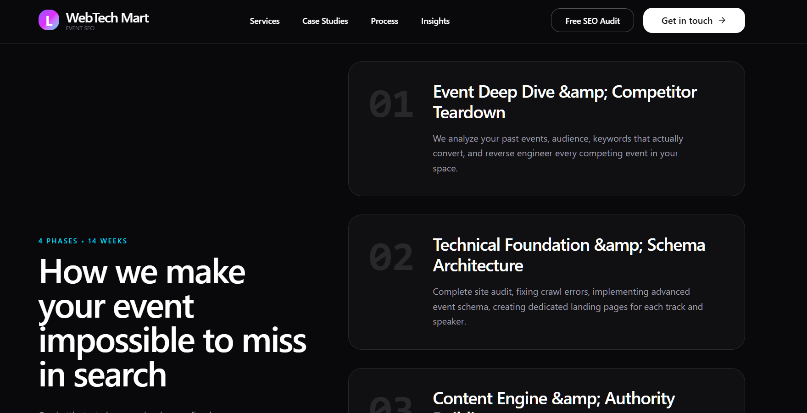

# WebTech Mart

A modern frontend web application built with Vite and TypeScript.

---

# Tech Stack

* Vite
* TypeScript
* Node.js
* npm

---

# Features

* Fast development using Vite
* TypeScript support
* Responsive UI
* Modern frontend structure
* Easy deployment with Vercel or Netlify

---

# Project Structure

```bash
webtech-mart/
│
├── src/
├── index.html
├── package.json
├── package-lock.json
├── tsconfig.json
├── vite.config.ts
```

---

# Getting Started

## 1. Clone the Repository

```bash
git clone https://github.com/monika0829/Event_Mart_SEO.git
```

## 2. Open Project Folder

```bash
cd webtech-mart
```

## 3. Install Dependencies

```bash
npm install
```

## 4. Start Development Server

```bash
npm run dev
```

The application will run on:

```bash
http://localhost:5173
```

---

# Build for Production

```bash
npm run build
```

The production files will be generated inside the `dist` folder.

---

# Preview Production Build

```bash
npm run preview
```

---

# Deployment

## Deploy on Vercel

1. Push the project to GitHub
2. Open Vercel
3. Import the repository
4. Deploy
---

# Requirements

* Node.js
* npm

Download Node.js:

[https://nodejs.org](https://nodejs.org)

---

# Available Scripts

| Command         | Description              |
| --------------- | ------------------------ |
| npm run dev     | Start development server |
| npm run build   | Create production build  |
| npm run preview | Preview production build |

---

# Screenshots

## Home Page

```md

```

## Case Studies

```md

```

## Insights

```md

```

## Process

```md

```

## SEO Built

```md

```

---

# License

This project is for learning and development purposes.
